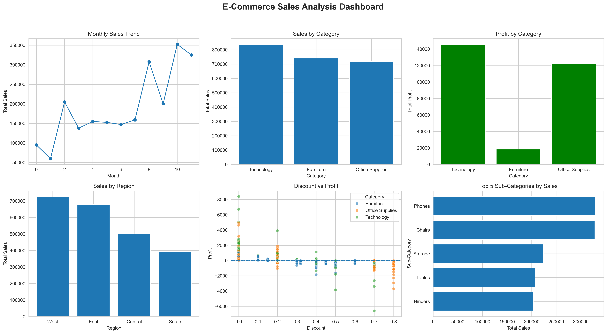
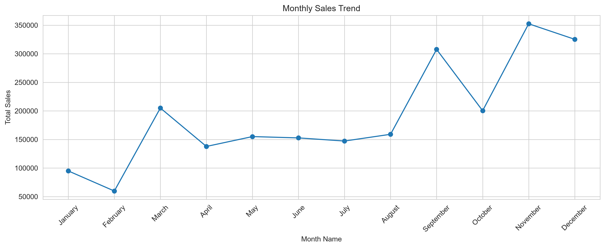
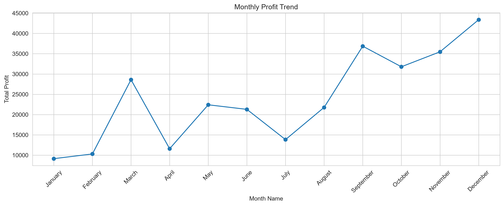
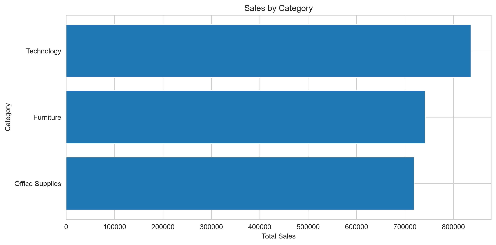
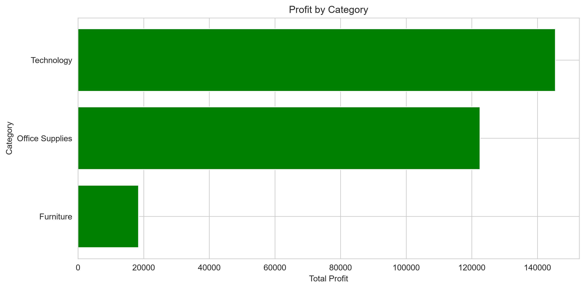
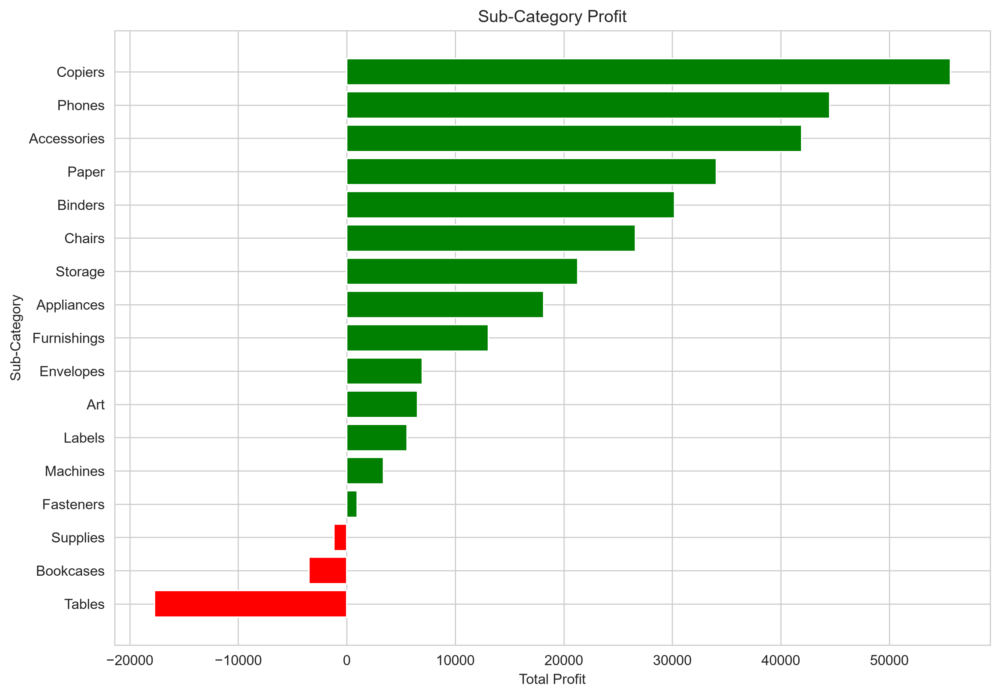
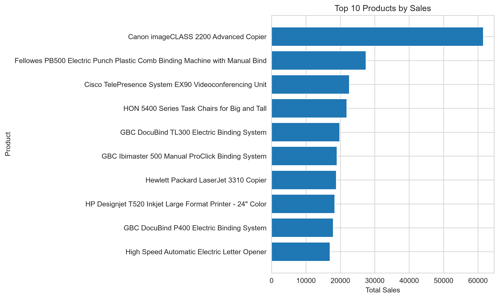
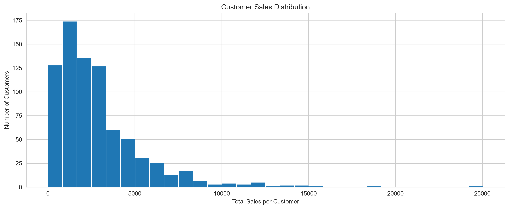
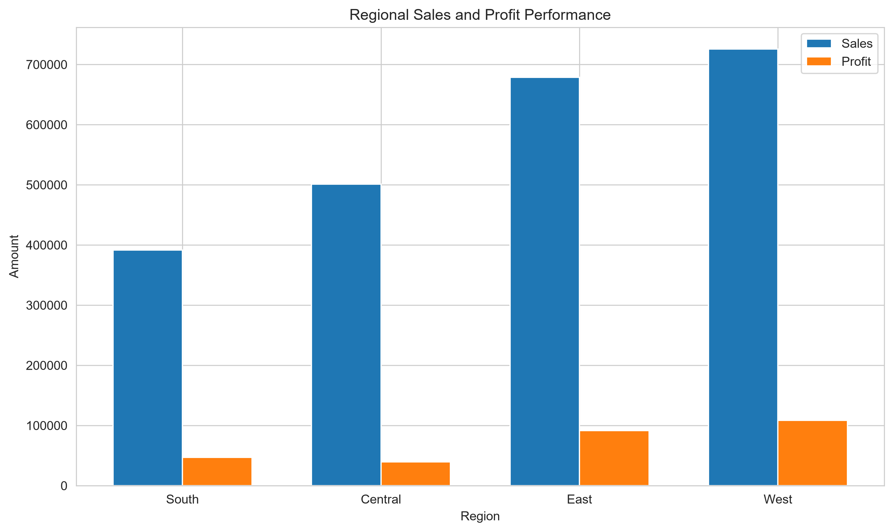
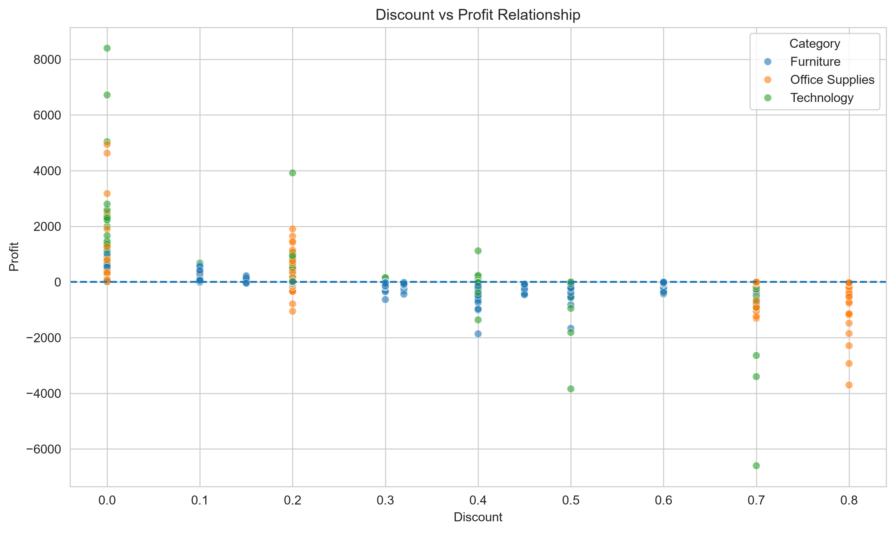

# E-Commerce Sales & Customer Analytics

An end-to-end data analysis project investigating sales performance, seasonal demand, product profitability, customer lifetime value, and discount elasticity using Python.



---

## 📖 Table of Contents
1. [Project Overview](#project-overview)
2. [Business Problems Solved](#business-problems-solved)
3. [Dataset Architecture](#dataset-architecture)
4. [Data Cleaning & Feature Engineering](#data-cleaning--feature-engineering)
5. [Exploratory Data Analysis & Visualizations](#exploratory-data-analysis--visualizations)
   - [Temporal Trends & Seasonality](#1-temporal-trends--seasonality)
   - [Category & Sub-Category Profitability](#2-category--sub-category-profitability)
   - [Product-Level Drivers](#3-product-level-drivers)
   - [Customer Segmentation & Spending Behavior](#4-customer-segmentation--spending-behavior)
   - [Geographic & Regional Disparities](#5-geographic--regional-disparities)
   - [Discount Depth vs. Margin Decay](#6-discount-depth-vs-margin-decay)
6. [Key Business Insights](#key-business-insights)
7. [Actionable Recommendations](#actionable-recommendations)
8. [Project Structure](#project-structure)
9. [How to Run](#how-to-run)

---

## 📌 Project Overview

Top-line revenue growth can often mask severe operational and pricing inefficiencies. An e-commerce business may generate record-breaking gross sales while bleeding margin on unprofitable sub-categories, poorly calibrated discounts, or high-cost fulfillment regions.

This project delivers a diagnostic analysis of a multi-year retail transaction dataset. The goal is to move beyond superficial surface metrics and evaluate **why** certain products, customer segments, and discount structures perform poorly, culminating in a data-backed turnaround strategy.

---

## 🎯 Business Problems Solved

This analysis answers key operational questions:
- **Revenue vs. Profit Health:** What are our actual baseline metrics (Total Sales, Net Profit, Average Order Value, Profit Margins)?
- **Seasonality:** Which months and quarters generate revenue spikes, and how does operating margin fluctuate with volume?
- **Portfolio Assessment:** Which categories drive volume versus cash flow? Which sub-categories are net loss-makers?
- **Customer Concentration:** What proportion of revenue is concentrated in top-tier buyers, and what does the average customer lifecycle look like?
- **Regional Discrepancies:** Are there high-volume states or regions generating negative returns?
- **Promotional Elasticity:** At what exact discount threshold does profitability turn negative?

---

## 📊 Dataset Architecture

- **Source:** Superstore Retail Sales Dataset (Publicly available transaction log)
- **Granularity:** Line-item order level (~9,994 rows × 21 columns)
- **Key Dimensions:** `Order ID`, `Order Date`, `Ship Date`, `Customer ID`, `Segment`, `City`, `State`, `Region`, `Product ID`, `Category`, `Sub-Category`, `Sales`, `Quantity`, `Discount`, `Profit`

---

## 🛠️ Data Cleaning & Feature Engineering

### 1. Data Cleaning
- **Datetime Parsing:** Converted string dates (`Order Date`, `Ship Date`) into standardized `datetime64` objects to enable time-series indexing.
- **Integrity Audits:** Confirmed zero duplicate order rows; validated that `Sales` and `Quantity` values were strictly positive.
- **String Sanitization:** Stripped leading/trailing whitespaces across textual categoricals (`State`, `Category`, `Sub-Category`).

### 2. Feature Engineering
To answer nuanced commercial questions, the raw data was enriched with derived features:
- **`Year` / `Month` / `Month_Name` / `Quarter`:** Extracted from `Order Date` for trend and seasonality decompositions.
- **`Profit_Margin`:** Computed as `(Profit / Sales) * 100` to measure return on sales at the row and category level.
- **`Discount_Range`:** Categorized raw discount rates into operational tiers:
  - `No Discount` (0%)
  - `Low Discount` (1% – 20%)
  - `Medium Discount` (21% – 40%)
  - `High Discount` (> 40%)
- **`Customer_Segment` (Engineered):** Aggregated metrics at the `Customer ID` level and applied quantile-based stratification (`qcut`) to classify customers into **High Value** (Top 20%), **Medium Value** (Middle 60%), and **Low Value** (Bottom 20%).

---

## 📈 Exploratory Data Analysis & Visualizations

### 1. Temporal Trends & Seasonality

E-commerce order volume exhibits consistent annual cyclicality driven by retail holiday cycles.

| Monthly Sales Trend | Monthly Profit Trend |
| :---: | :---: |
|  |  |

- **Q4 Surge:** Revenue accelerates aggressively starting in September, peaking in **November and December**. Holiday shopping campaigns drive substantial gross sales.
- **Margin Divergence:** While November registers the highest monthly sales volume, the net profit margin does not scale proportionally due to aggressive promotional pricing during Black Friday/Cyber Monday periods.

---

### 2. Category & Sub-Category Profitability

High revenue does not automatically equal high margin.

| Category Sales | Category Profit |
| :---: | :---: |
|  |  |

- **Technology** generates the largest gross sales and the highest nominal profit, supported by strong performance in Copyers and Phones.
- **Furniture** produces strong gross sales but exceptionally poor profit margins, dragged down by heavy shipping overhead and deep discounting.

#### Sub-Category Profit Breakdown


- **Profit Anchors:** `Copiers`, `Phones`, and `Accessories` yield the healthiest margins.
- **Loss Leaders:** `Tables`, `Bookcases`, and `Supplies` consistently post negative net returns. `Tables` alone represents the single largest margin drain across the catalog.

---

### 3. Product-Level Drivers



- High-ticket enterprise technology items (such as the *Canon imageCLASS Advanced Copier*) contribute disproportionately to both top-line revenue and bottom-line profit.
- A critical subset of high-revenue products in the Furniture department display negative net margins, meaning every additional unit sold increases financial loss.

---

### 4. Customer Segmentation & Spending Behavior

Aggregating transactional records to the unique customer level reveals spend concentration patterns.



- **Pareto Dynamic:** The top 20% of customer accounts (**High Value**) account for over **50% of total revenue**.
- **Repeat Orders:** The median customer makes between 5 to 9 separate purchases across the multi-year timeline, indicating strong organic retention among core accounts.

---

### 5. Geographic & Regional Disparities



- **West and East** are the most lucrative commercial hubs, characterized by both high sales density and stable positive margins.
- **Central Region** suffers from severe margin compression: despite healthy transaction counts, net margins are dragged down by aggressive discounting practices in states like Texas and Illinois.

---

### 6. Discount Depth vs. Margin Decay

Discounting is the single largest variable dictating order profitability.



- **The Danger Zone:** Discounts between **0% and 20%** maintain positive profit margins. Once discounts exceed **20%**, profit margins drop sharply below the break-even line ($0).
- **Correlation:** A strong negative correlation exists between `Discount` and `Profit`, confirming that promotional markdowns are not being compensated by sufficient volume elasticity.

---

## 🔍 Key Business Insights

1. **Promotional Value Destruction:** Discounts above 20% consistently destroy operating margins. Markdowns past 40% generate catastrophic line-item losses regardless of product category.
2. **Furniture Department Drag:** Furniture delivers an anaemic profit margin (~2-3%) compared to Technology (~17-18%). Tables and Bookcases operate as unhedged loss-leaders.
3. **Severe Regional Discrepancies:** While California and New York generate healthy profits, Texas, Ohio, and Pennsylvania produce net losses due to a high volume of orders placed at 40-80% discounts.
4. **Heavy Top-Tier Reliance:** Over half of all operating income depends on the top 20% customer cohort. Protecting and retaining this segment is critical for baseline stability.
5. **Q4 Execution Inefficiency:** High Q4 sales volumes are diluted by heavy promotional discounting. Margin realization per dollar sold is lowest during the peak volume window.

---

## 💡 Actionable Recommendations

### 1. Enforce a Firm Discount Ceiling
- Cap standard sales rep discounting at **15%**.
- Require senior management sign-off for any commercial promotion exceeding **20%**.
- Eliminate all 50%+ clearance markdowns in the Central region.

### 2. Restructure the Product Mix
- **Tables & Bookcases:** Re-evaluate supplier contracts, increase base prices, or bundle these loss-making items with high-margin accessories rather than selling them standalone.
- **Technology Focus:** Allocate more marketing and paid acquisition budget toward Enterprise Tech and Office Technology categories, which demonstrate clear pricing power.

### 3. Regional Pricing & Freight Surcharges
- Implement regional pricing models in loss-making states (Texas, Illinois, Pennsylvania, Ohio).
- Introduce shipping minimums or direct freight pass-through pricing on bulky furniture orders delivered to long-distance zones.

### 4. VIP Account Retention Program
- Build a dedicated retention and account-management strategy for the top 20% customer tier.
- Transition high-value accounts from transaction-level discounts to loyalty-driven perks (e.g., expedited fulfillment, dedicated support, tier-based annual rebates).

---

## 📂 Project Structure

```text
E-Commerce-Sales-Analysis/
│
├── data/
│   └── superstore.csv                  # Raw transaction dataset
│
├── notebooks/
│   └── ecommerce_analysis.ipynb        # Cleaned, documented Jupyter Notebook
│
├── images/
│   ├── analysis_dashboard.png          # Executive multi-panel summary
│   ├── monthly_sales_trend.png         # Monthly time-series sales trend
│   ├── monthly_profit_trend.png        # Monthly time-series profit trend
│   ├── category_sales.png              # Gross revenue by category
│   ├── category_profit.png             # Net profit by category
│   ├── subcategory_profit.png          # Profit/loss by sub-category
│   ├── top_products_sales.png          # Top 10 revenue-generating SKUs
│   ├── customer_distribution.png       # Customer spend histogram
│   ├── regional_performance.png        # Sales vs. Profit by region
│   └── discount_vs_profit.png          # Scatter analysis of margin elasticity
│
├── requirements.txt                    # Exact library dependencies
├── README.md                           # Project documentation & business report
└── .gitignore                          # Standard git excludes
```
## How to Run
1.** Clone the Repository**
Bash

git clone https://github.com/your-username/Shoplytics.git
cd Shoplytics
2. Set Up Virtual Environment & Dependencies
Bash

python -m venv venv
# Windows:
venv\Scripts\activate
# Mac/Linux:
source venv/bin/activate

pip install -r requirements.txt
3. Open Notebook
Bash

jupyter notebook notebooks/ecommerce_analysis.ipynb
💻 Tech Stack
Language: Python 3.x
Libraries: Pandas, NumPy, Matplotlib, Seaborn
Environment: Jupyter Notebook / VS Code
